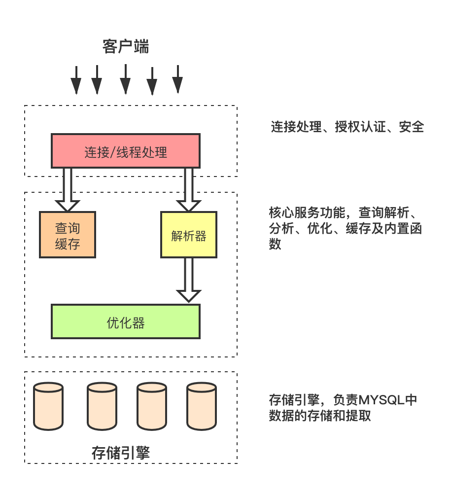

# Mysql 基础架构

## Mysql服务器逻辑架构图

1. 第一层负责连接管理、授权认证、安全等等。
   每个客户端的连接都对应着服务器上的一个线程。服务器上维护了一个线程池，避免为每个连接都创建销毁一个线程。当客户端连接到MySQL服务器时，服务器对其进行认证。可以通过用户名和密码的方式进行认证，也可以通过SSL证书进行认证。登录认证通过后，服务器还会验证该客户端是否有执行某个查询的权限。

2. 第二层负责解析查询(编译SQL)，并对其进行优化(如调整表的读取顺序，选择合适的索引等)。对于SELECT语句，在解析查询前，服务器会先检查查询缓存，如果能在其中找到对应的查询结果，则无需再进行查询解析、优化等过程，直接返回查询结果。存储过程、触发器、视图等都在这一层实现。

3. 第三层是存储引擎，存储引擎负责在MySQL中存储数据、提取数据、开启一个事务等等。存储引擎通过API与上层进行通信，这些API屏蔽了不同存储引擎之间的差异，使得这些差异对上层查询过程透明。存储引擎不会去解析SQL。